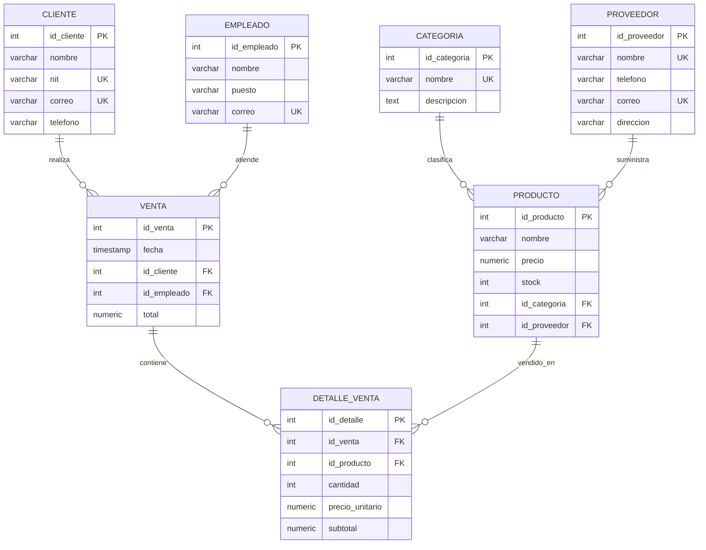

# Diagrama ER

Este diagrama representa las entidades principales del sistema, sus atributos, llaves primarias, llaves foráneas y relaciones necesarias para gestionar inventario, proveedores, clientes, empleados y ventas.

